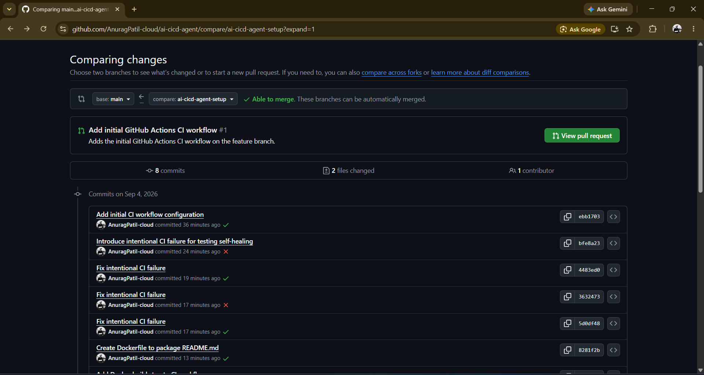
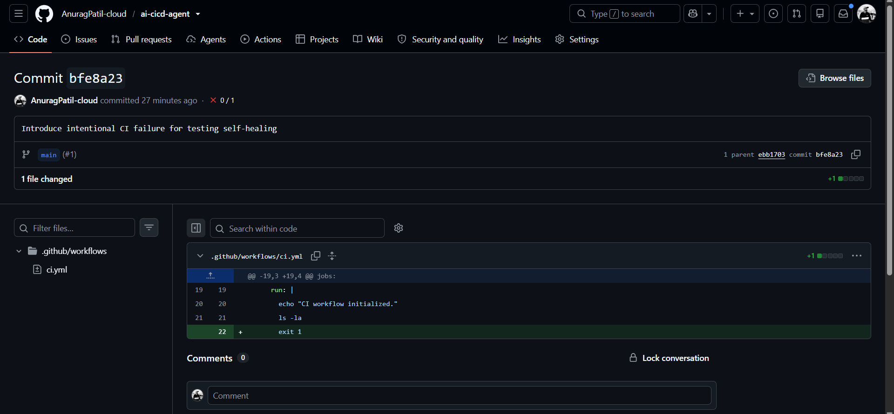

# AI CI/CD Agent

An autonomous AI agent that connects a Gemini LLM to a GitHub repository through the **GitHub MCP server**, so it can inspect a codebase and safely evolve its CI/CD setup — creating a `Dockerfile`, wiring a Docker build step into GitHub Actions, and committing the changes itself.

The agent is deliberately constrained: it can only read and write files, it only operates on a pre-existing feature branch, and it can never touch `main` or open/merge a pull request. All GitHub access goes through two whitelisted tools, so its "blast radius" is small even though it's making real commits.


## How it works

```
 ┌──────────────┐      ┌───────────────────┐      ┌───────────────────────┐
 │  Gemini LLM  │◄────►│  LangChain Agent   │◄────►│  GitHub MCP Server     │
 │ (reasoning)  │      │ (create_agent)     │      │ (@modelcontextprotocol │
 └──────────────┘      └───────────────────┘      │   /server-github)      │
                                 │                  └───────────┬────────────┘
                                 │  allowed tools only:                     │
                                 │   - get_file_contents                    ▼
                                 │   - create_or_update_file        Your GitHub repo
                                 ▼                                  (feature branch only)
                          Task instructions
                          (system prompt + task string)
```

1. **`langchain_google_genai`** provides the reasoning model (`gemini-3.1-flash-lite-preview`).
2. **`langchain_mcp_adapters`** spins up the official GitHub MCP server over stdio (`npx @modelcontextprotocol/server-github`) and exposes its tools to the agent.
3. The agent's tool access is filtered down to just `get_file_contents` and `create_or_update_file` — it cannot create branches, open PRs, or touch anything outside those two operations.
4. A strict system prompt tells the agent which repo, which branch, and which files it's allowed to modify.
5. The agent is given a task (e.g. "add a Dockerfile and a Docker build step to CI") and reports back what it changed, including commit SHAs.

## Features

- **Scoped GitHub access** — talks to GitHub exclusively through the GitHub MCP server, never raw API calls.
- **Tool allow-listing** — only `get_file_contents` and `create_or_update_file` are exposed to the agent, regardless of what the MCP server offers.
- **Guardrails baked into the prompt** — never modify `main`, never create a new branch, never open or merge a pull request, only touch the files it's told to.
- **Self-contained Docker automation** — inspects the repo, generates a `Dockerfile`, and adds a `docker build` step to the existing GitHub Actions workflow without breaking it.
- **Structured reporting** — the agent's final response lists what it created/changed, the commit message(s), commit SHA(s), and the branch used.
- **Connectivity test scripts** — `test.py` and `github_test.py` let you verify your Gemini and GitHub MCP credentials independently before running the full agent.

## Screenshots

**Pull request comparing the agent's feature branch against `main`** — 8 commits, including the Dockerfile and CI changes, ready to merge:



**GitHub Actions run after the changes were committed — the Docker build step passes alongside the rest of the pipeline:**

[GitHub Actions CI workflow run]


**A single successful CI run, with the `Build Docker image` step completing after the earlier pipeline steps:**

[Build successful]


**A commit that intentionally broke CI (`exit 1` added to the workflow) — used to verify the pipeline surfaces failures before a follow-up commit fixes it:**



**Provisioning a server for the agent — installing Node.js, which the GitHub MCP server needs to run via `npx`:**


## Prerequisites

- Python 3.11+
- Node.js + npm (the GitHub MCP server is launched with `npx`)
- A [Google AI Studio](https://aistudio.google.com/) API key with access to Gemini
- A GitHub [personal access token](https://github.com/settings/tokens) with `repo` scope
- A GitHub repository that already has an `.github/workflows/ci.yml` and an existing feature branch for the agent to work on (the default branch name expected is `ai-cicd-agent-setup`)

## Installation

```bash
git clone https://github.com/AnuragPatil-cloud/ai-cicd-agent.git
cd ai-cicd-agent

python3 -m venv venv
source venv/bin/activate

pip install python-dotenv langchain langchain-google-genai langchain-mcp-adapters
```

## Configuration

Create a `.env` file with:

| Variable | Description |
|---|---|
| `GOOGLE_API_KEY` | API key for the Gemini model |
| `GITHUB_PERSONAL_ACCESS_TOKEN` | GitHub PAT with permission to read/write the target repo |
| `GITHUB_USERNAME` | Owner of the target repository |
| `GITHUB_REPO` | Name of the target repository |

`cicd_agent.py` currently loads its `.env` from a fixed path (`/root/ai-devops-agent/.env`) — update `load_dotenv(...)` to point at your own `.env` location, or move the file to match.

## Usage

**1. Verify your Gemini + GitHub MCP connection:**

```bash
python test.py
```

**2. Verify GitHub MCP tools and run a sample repository search:**

```bash
python github_test.py
```

**3. Run the Docker automation agent against your repo:**

```bash
python cicd_agent.py
```

The agent will:
1. Connect to the GitHub MCP server and load only the whitelisted tools.
2. Inspect the target repo's existing `README.md` and `.github/workflows/ci.yml`.
3. Create a `Dockerfile` (based on `python:3.11-slim`) at the repo root.
4. Add a `docker build -t ai-cicd-agent:ci .` step to the CI workflow, preserving the existing steps.
5. Commit both changes to the pre-existing feature branch, and print the commit SHAs and a summary — it will not open a pull request for you.

## Project structure

```
ai-cicd-agent/
├── cicd_agent.py               # Main agent: adds Dockerfile + CI build step
├── github_test.py              # Sanity check for GitHub MCP tools
├── test.py                     # Sanity check for Gemini + GitHub MCP
├── Dockerfile                  # Minimal image that packages README.md
├── .github/workflows/ci.yml    # CI pipeline (Python setup + Docker build)
├── screenshots/                # Screenshots used in this README
└── .gitignore
```

## Safety guardrails

The agent's system prompt enforces the following rules on every run:

1. Never modify `main`.
2. Never create another branch.
3. Never create or merge a pull request.
4. Only work on the pre-configured feature branch.
5. Inspect existing files before updating them.
6. Only modify `Dockerfile` and `.github/workflows/ci.yml`.
7. Never expose secrets or credentials.
8. Preserve the existing CI workflow unless a change is required for Docker support.

## Limitations

- The agent is scoped to a single, narrow task (Docker + CI wiring) — it's a starting point for broader "AI DevOps" automation, not a general-purpose CI/CD manager.
- It expects the target branch to already exist; it won't create one for you.
- Model name (`gemini-3.1-flash-lite-preview`) and file paths (like the hardcoded `.env` path) are set for the author's environment — adjust them for yours before running.

## License

No license file is currently included in this repository. Add one (e.g. MIT) if you intend for others to reuse this code.
